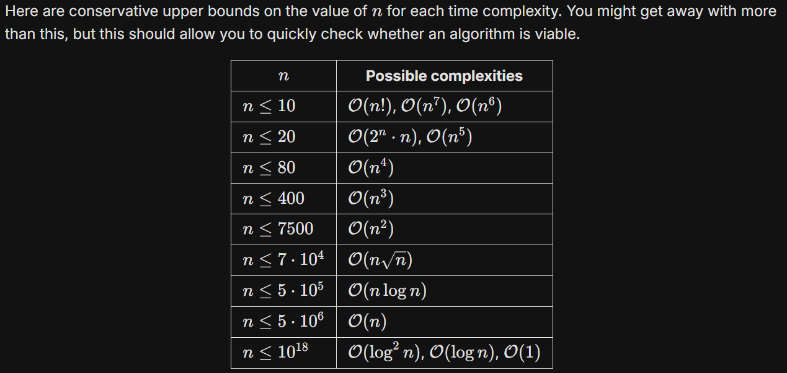

# Important Algorithms 

[reference](https://www.geeksforgeeks.org/top-algorithms-and-data-structures-for-competitive-programming/)

## Time Complexity And Expected Time

[reference](https://www.bigocheatsheet.com/)

## Prefix Sums:

Techiniques : 
1. Simple Maximum Subarray Sum, with given queries
2. Cumaltive Count of Characters upto ith index - Used in a string exists in another string or not.
[Prefix Sum](https://usaco.guide/silver/prefix-sums)
